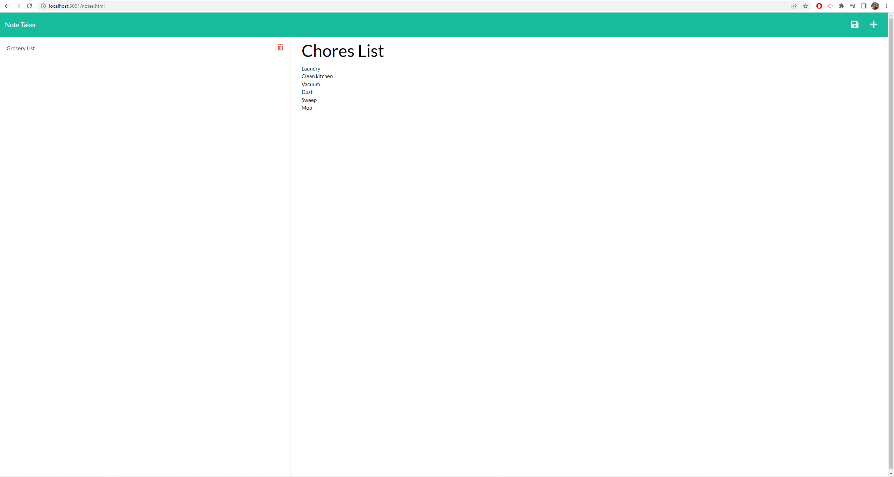

# Note-taker
________________________________________________________________
This app is an example of a note taking app that uses the node package called express for handling routes. This project also uses the node package called uuid for giving each note a unique id for handling deletion. Technologies in this application include JavaScript, NodeJS, Express.js, UUID, and others. 

## Requirements
________________________________________________________________
```
GIVEN a note-taking application
WHEN I open the Note Taker
THEN I am presented with a landing page with a link to a notes page
WHEN I click on the link to the notes page
THEN I am presented with a page with existing notes listed in the left-hand column, plus empty fields to enter a new note title and the note’s text in the right-hand column
WHEN I enter a new note title and the note’s text
THEN a Save icon appears in the navigation at the top of the page
WHEN I click on the Save icon
THEN the new note I have entered is saved and appears in the left-hand column with the other existing notes
WHEN I click on an existing note in the list in the left-hand column
THEN that note appears in the right-hand column
WHEN I click on the Write icon in the navigation at the top of the page
THEN I am presented with empty fields to enter a new note title and the note’s text in the right-hand column
```

## Usage
________________________________________________________________
To use the application, the user must simply go to the deployed application, and then they will be presented with a button that reads get started. After clicking on that button, the application will show an area labled Note Title, and Note Text below that. After the user entes a title, and a body to the note, There will be a save button that populates in the top right corner of the page. After clicking this button, the note will then be saved, and the note title will be displayed on the left hand column of the page, and the filler text for a new note will be present. The user can also delete the notes that are in the left hand column by clicking the trash can button. Currently, the note is deleted, but is only reflected as such when the user refreshes the page. Adding behavior of the page refreshing automatically when the delete button is pressed could be added functionality in the future.  

## Challenges in development
________________________________________________________________
The main challenges in developing this application were getting the routes to work correctly. It turns out that I was really close the whole time, but the front end of the application, which was included in the starter code, had it to where instead of going to /notes, the url had to end with /notes.html. After rectifying that issue, getting the new note to show up was challenging. The proper syntax for a post request challenged me. Thankfully with the help of my instructor, I was able to get it to work properly. 

## Screenshot
________________________________________________________________


## Deployed Code
________________________________________________________________
GitHub: https://brandonelliott0530.github.io/Note-taker/
________________________________________________________________
Heroku: https://shielded-headland-75043.herokuapp.com/ 

## Contact Me:
________________________________________________________________
Email: brandonelliott0530@gmail.com
________________________________________________________________
GitHub: https://github.com/brandonelliott0530